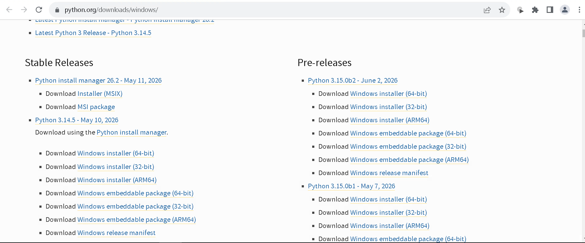
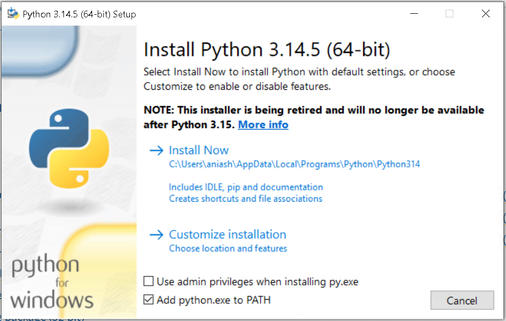

# Racpad Support Tool 

Quick instructions to get the app running locally on Windows.

## Prerequisites — Install Python (one-time, no admin rights required)

> Skip this section if Python is already installed on your machine.

1. Go to **https://www.python.org/downloads/windows/**

   

2. Under **Stable Releases**, find **Python install manager** and click **Download Windows Installer (64-bit)** to download the Windows Install Manager `.exe`.
3. Once downloaded, **double-click the `.exe`** to launch the installer.
4. On the installer's first screen:
   - **Uncheck** `Use admin privileges when installing py.exe`
   - **Keep checked** `Add python.exe to PATH`

   

5. Click **Install Now** and wait for the installation to complete.
6. Close the installer when done.

## Requirements

- Windows 10 / 11
- Python 3.10 or newer (see Prerequisites above)
- Network access to your RAC / Pricing databases (VPN if required)

## Getting Started

1. **Clone or copy the project folder** to your local machine.

2. **Initial Setup (one-time only)**
   - Double-click the `setup.bat` file in the project folder. This will create a virtual environment and install all required dependencies.

3. **Run the Application**
   - Anytime you want to launch the app, simply double-click the `run.bat` file. This will start the Flask server.
   - Open your browser and go to: http://127.0.0.1:8501

## First-time Configuration (in the app)

- Open the **Setup** page in the app and configure SMTP (email) and DB connection info.
- DB credentials use Kerberos (no password required) — only host, port, dbname, and user are needed.

## Notes

- Credentials are stored in the OS credential manager (Windows Credential Manager).
- If you need to reset stored credentials, use the **Clear Credentials** button in the Setup page.

## Distribution

- Share this folder with teammates. They only need Python installed and to double-click `setup.bat` (once) and then `run.bat` to use the tool.

## Troubleshooting

- If the browser cannot reach the app, confirm the server is running and no firewall blocks port 8501.
- If DB connections fail, verify VPN/network and the values entered on the Setup page.

## License / Contact

- Internal tool — share only within the team. For issues, contact the tool owner.
